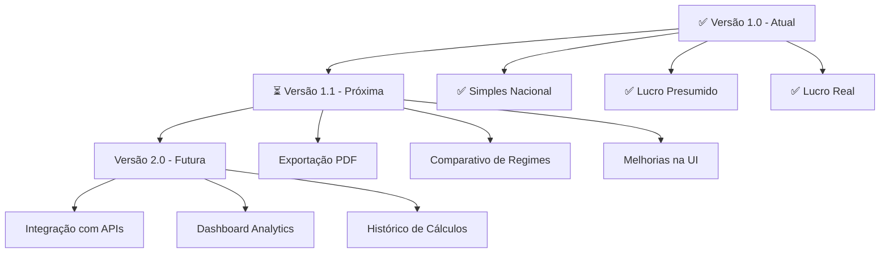

<div align="center">

# 💰 Calculadora de Impostos ME/EPP

### 🇧🇷 Simples Nacional, Presumido e Real

<p>
  <a href="#-sobre-o-projeto">Sobre</a> •
  <a href="#-funcionalidades">Funcionalidades</a> •
  <a href="#-tecnologias">Tecnologias</a> •
  <a href="#️-como-executar">Como Executar</a> •
  <a href="#-contato">Contato</a>
</p>


</div>

---

## 📱 Demonstração da Aplicação

<p align="center">

</p>

<h4 align="center">
  Aplicação Finalizada ✅
</h4>

---

## 🚀 Sobre o Projeto

Este projeto é uma **Calculadora de Impostos interativa** desenvolvida em Python com Streamlit, destinada a simular de forma simplificada a carga tributária em três dos principais regimes fiscais brasileiros: **Simples Nacional**, **Lucro Presumido** e **Lucro Real**.

###  Objetivo Principal
Servir como peça de **portfólio profissional**, demonstrando proficiência em:

- ** Desenvolvimento Web Rápido**: Utilizando o Streamlit para criar uma interface de usuário funcional
- ** Modularização e Boas Práticas Python**: Uso de funções, tipagem de dados (type hinting) e separação clara da lógica (`calculadora_impostos.py`) da interface (`app.py`)
- ** Modelagem de Lógica de Negócio (Fiscal)**: Codificando as regras simplificadas de cálculo baseadas nas legislações vigentes

---

##  Funcionalidades

- [x]  **Cálculo Simples Nacional**
  - Faixas de faturamento automáticas
  - Cálculo baseado no faturamento anual
  - Resultado: Imposto mensal estimado

- [x]  **Cálculo Lucro Presumido** 
  - Diferentes tipos de atividade
  - Base: Faturamento trimestral
  - Resultado: Imposto trimestral estimado

- [x]  **Cálculo Lucro Real**
  - Receitas totais e despesas dedutíveis
  - Cálculo do lucro real apurado
  - Resultado: Imposto total estimado

- [x]  **Interface Intuitiva**
  - Design responsivo e moderno
  - Validação em tempo real
  - Resultados instantâneos

###  Resumo dos Regimes Tributários

| Regime Fiscal | Base de Cálculo | Saída Estimada | Status |
|:---:|:---:|:---:|:---:|
|  **Simples Nacional** | Faturamento Anual | Imposto Mensal | ✅ Implementado |
|  **Lucro Presumido** | Faturamento Trimestral + Tipo de Atividade | Imposto Trimestral | ✅ Implementado |
|  **Lucro Real** | Receita Total + Despesas Dedutíveis | Imposto Total | ✅ Implementado |

---

##  Tecnologias Utilizadas

<table>
  <tr>
    <td><strong>Tecnologia</strong></td>
    <td><strong>Badge</strong></td>
    <td><strong>Descrição</strong></td>
  </tr>
  <tr>
    <td>Python</td>
    <td></td>
    <td>Linguagem principal de desenvolvimento</td>
  </tr>
  <tr>
    <td>Streamlit</td>
    <td></td>
    <td>Framework para interface web responsiva</td>
  </tr>
  <tr>
    <td>Git & GitHub</td>
    <td></td>
    <td>Controle de versão e hospedagem do repositório</td>
  </tr>
</table>

---

## ⚙️ Como Executar o Projeto Localmente

### 📋 Pré-requisitos

Certifique-se de ter o **Python 3.8+** instalado em sua máquina.

### 🔧 Passo a Passo

#### 1.  Clonar o Repositório

```bash
# Clone este repositório
git clone https://github.com/rogeramorim7/calculadora-impostos-br-streamlit.git

# Acesse a pasta do projeto
cd calculadora-impostos-br-streamlit
```

#### 2.  Configurar o Ambiente Virtual

```bash
# Crie o ambiente virtual
python -m venv venv

# Ative o ambiente virtual
# Linux/macOS:
source venv/bin/activate

# Windows:
.\venv\Scripts\activate
```

#### 3.  Instalar as Dependências

```bash
# Instale as dependências
pip install -r requirements.txt
```

#### 4.  Executar a Aplicação

```bash
# Execute o aplicativo
streamlit run app.py
```

O aplicativo será aberto automaticamente no seu navegador em: **http://localhost:8501**

---

##  Isenção de Responsabilidade

<div align="center">

> ### ⚠️ **Importante**: Disclaimer Legal
> 
> Este projeto foi desenvolvido exclusivamente para **fins educacionais e de portfólio**.  
> Os cálculos são **simplificações didáticas** e **não substituem** consulta profissional.
> 
> **Limitações dos Cálculos:**
> - ❌ Não considera o Fator R (Simples Nacional)
> - ❌ Não inclui adicional de IRPJ
> - ❌ Não contempla diferenças estaduais (ICMS) ou municipais (ISS)
> - ❌ Não aborda outras particularidades fiscais específicas
> 
> 👨‍💼 **Consulte sempre um contador certificado** para decisões fiscais reais.

</div>

---

##  Roadmap do Projeto



---

##  Contribuindo

Contribuições são sempre bem-vindas! Se você tem sugestões para melhorar este projeto:

1.  Faça um **Fork** do projeto
2.  Crie uma **Branch** para sua feature (`git checkout -b feature/AmazingFeature`)
3.  **Commit** suas mudanças (`git commit -m 'Add some AmazingFeature'`)
4.  **Push** para a Branch (`git push origin feature/AmazingFeature`)
5.  Abra um **Pull Request**

---

## 📞 Contato

<div align="center">

### 🤝 Vamos nos Conectar?

  <a href="https://www.linkedin.com/in/rogerdeamorim/" target="_blank">
    
  </a>
  
  <a href="https://github.com/rogeramorim7" target="_blank">
    
  </a>
  
  <a href="https://www.instagram.com/rogerdeamorim_/" target="_blank">
    
  </a>

**Roger Amorim** - Estudante

</div>

---

<div align="center">
  
  ### 🌟 Gostou do projeto?
  
  Se este projeto foi útil para você, considere deixar uma ⭐!
  
  <a href="https://github.com/rogeramorim7/calculadora-impostos-br-streamlit">
    
  </a>
  
  <a href="https://github.com/rogeramorim7/calculadora-impostos-br-streamlit/fork">
    
  </a>
  
  ---
  
  <sub>Feito por <a href="https://github.com/rogeramorim7">Roger Amorim</a></sub>
  
  <sub>Este projeto representa o ponto final de um esforço que uniu lógica de negócios (fiscal) e desenvolvimento moderno em Python com Streamlit.</sub>
  
</div>
